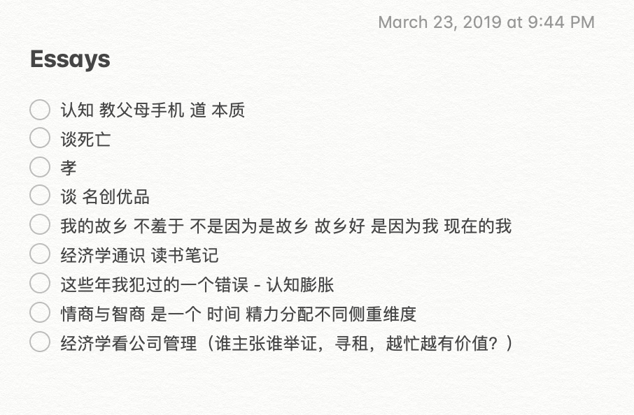

# 一种轻量级的知识分享形式

在我司，有一种常见的知识分享方式叫做「案例」。

所谓案例，其实就是对现实中某个事件的真实记录和客观叙述。代入我司的语境下，就是某个问题的解决方案记录。案例可以帮助个人和团队积累经验，提升能力，避免重复犯错。一个公司的技术沉淀，可能很大一部分就是沉淀到案例库中的那一篇篇文档。

案例这么好，但不代表员工爱写。实际上，由于惰性、没时间、无直接收益（或激励）等种种原因，真正乐于主动写案例的人很少。然而案例写作是逃不掉的，因为通常案例的写作数目会与个人的绩效考评挂钩。在这种机制的影响下，案例库中的案例可能很多都是为应付绩效指标诞生的。

强大的制度使案例数目有了保证，而且员工绞尽脑汁为了要凑出足够的案例，肯定优先写的是工作中印象最深的事件，因此内容质量也不至于毫无价值。案例的数目和质量都能保证，就一定能取得良好的效果吗？不一定。

如何能降低知识分享的成本，让人们乐于分享、无负担地分享？

如何能提高知识分享的效率，让知识真正的能为人所用？

看过《思考，快与慢》的同学肯定知道「系统一」和「系统二」的概念。抛开概念本身，其实它描述了一个自然界广泛存在的机制，叫它分层处理机制也好、缓存机制也罢。直觉能帮助你对情境做出快速反应，但这一层的处理速度虽快，但是处理能力较弱，对于无法处理的场景，就需要动用逻辑思维能力，虽然速度会慢甚至一个数量级，但处理能力要强很多。

我们随手发一条朋友圈、发一条微博并不需要过多思考，或许只需要稍微遣词造句一下。但是回想一下你写一篇文章的感觉，你可能要梳理观点、寻找论据、构思结构，并将语言的通顺性、连贯性、逻辑性检查等贯穿写作过程始终。写作，尤其是较长篇幅的写作是一个思维密集型活动，很重。是「重」限制了我们主动写案例，由于受到生命有限的基本约束，人类早已获得了在潜意识里不断权衡利弊的特性。即使你知道写篇案例是非常有价值的，但是潜意识也会告诉你，这件事成本很高，不要做。

你看，自打我开了公众号以来，几近断更，已经积压了这么多想写的主题。除了反映我的懒惰以外，也充分证明了写文章真的需要付出很高的成本：有这个时间，我可以刷刷新闻、看看视频、听听播客、看看书、散散步、哪怕简单地望向窗外放松一下也好。

解决之道很简单，那就是缩减写作的篇幅，篇幅减少了，成本也就降低了。人们厌恶的是成本，而不是知识分享本身。把知识分享变得和发朋友圈、发微博一样轻松，那么人人都会乐于分享，这就是我标题所说的「轻量级知识分享形式」。轻量带来的另一个好处就是传播效率的大幅提升，你看，一举两得。

让我们设想一下公司有一个类似微博的平台，你可以随时把最近在做什么事情、工作中遇到了什么难题、有什么疑问、什么思考分享出来。难题或疑问得到解决时再转发当时的那条疑问并附上解决方案，如果必要，可以再附上一篇详细的说明案例的链接。一个部门或一个团队可以组成一个圈子，你们能看到彼此的动态，当然你也可以关注任何一个你感兴趣的人。每天抽出几十分钟就可以大致知道团队中每个人的工作重心、进度以及遇到的问题，提出的问题也能引发普遍的讨论或思考，待到问题解决时，解决方案也能给你的关注者提供启发。

这个轻量级分享平台不是要取代案例，而是一个案例这种重量级、详细内容的索引机制。如果某个问题关注的人多、期待的人多，你当然会有动力将其总结成一篇详细的案例，你可以收获成就感、认同感，满足一下虚荣心，而不是像现在这样，写案例的时候心里还犯嘀咕：「写了可能也没人看」。同时，这个机制也能帮助我们避免在那些未来参考价值不大甚至当下参考价值也不是很大的案例上浪费宝贵的时间。

前面我说了，待写的文章积累了这么多没写也有一部分原因是我总追求面面俱到，有「怕露怯」的思想在后面作祟，生怕哪里说得不到位暴露自己的无知。加之平时工作确实很忙等种种原因，才导致很多想写的却又迟迟不能落笔。因此，写这篇时我极力克制自己不要过度展开，过分在意细节，花 20 % 的精力达到 80 % 的完成度就好。基于我目前的能力水平，尽量降低成本，增加产出，采取更健康的少量多餐模式。

